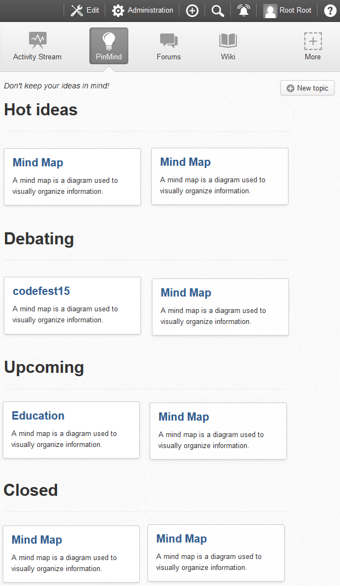
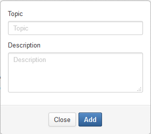

Codefest 2015 team G repository
===========

# The team G - 4.PINS

TEAM MEMBER | EXO TEAM
------------ | -------------
Trần Thị Thùy Dương | ADM
Lê Thị Thu Hà | UXP
Nguyễn Thị Lan | DOC
Đặng Thị Mây | UXP

# How to build

	git clone git@github.com:exo-codefest/2015-team-G.git
	cd 2015-team-G
	mvn clean install

# Overview 

* Name: PinMind Add-on

* Purposes:  Facilitate brainstorming process between team members and allow voting to select great ideas effectively and efficiently

# Definitions:

- A team can work on many debating topics
- A topic should be discussed between members to collect ideas
- Each idea should be evaluated by all members
- A topic can have one among the following status: Debating, Upcoming, Closed
- An idea can have a special status as “hot idea” if it is called for voting by the administrator

# Done features:

- Creating new topic
- Adding sub ideas
- Removing sub ideas
- Creating mind map  to work on each topic
- Editing topics and ideas 
- Following hot ideas 

# How to use:

**Step 1**. Create a new space such as “Team G”, after that, the add-on PinMind will be automatically added to this space on the navigation bar as follows:

**Step 2**. Click  to add a new topic:

 
 
Fill essential information in this form and click Add button, the new topic will be displayed.
 
**Step 3**. Click on the topic you want to edit, you will be redirected to the diagram screen with the root node only:

**Step 4**. Right-click on the root node to access menu bar:

**Step 5**. Select Add node to add new sub ideas:

or Edit node to edit the node content:

Press Enter key to accept changes.
Or Remove node to delete the selected node. This node and its children will be deleted.

**Step 6**. Besides, you can click on any node to move focusing on this node , its parent as well as its children

In addition, this tool provides "hot ideas" function to allow keeping up the debating topics and hot ideas:

# Perspectives:

- Voting: allow members to vote for all ideas
- Graphics design: provide more responsive and attractive design to increase user experience
- Notification: enable sending notifications to members when the administrator makes a call for voting
- Import/export ideas tree: quickly import and export the ideas tree under a specific data format
